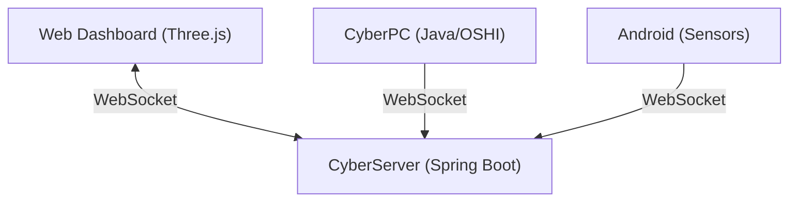

# CyberObserver (CyberMonitor) | 赛博视奸

> **Cyberpunk Style Cross-Device Real-time Monitoring System**
>
> **赛博朋克风格跨设备实时监控系统**

  

---

## 🌌 Vision | 愿景

*"In the digital void, I see myself."*

**CyberObserver** represents the ultimate pursuit of **Digital Self-Awareness**. It is a holistic surveillance project born from a single developer's uncompromising desire for control and perfection. Using a minimalist Java technology stack, we bridge the gap between physical reality and digital representation.

**CyberObserver** 象征着对 **数字自我意识** 的终极追求。这是一个诞生于极客对掌控与完美的不妥协渴望的赛博监控项目。我们以极简的 Java 全栈技术为桥梁，打破物理现实与数字孪生的界限。

The goal is to achieve **Omniscient Perception**:
- **Full-Spectrum Collection**: Aggregating battery status, active applications, background processes, and high-frequency sensor data from PCs and Mobile phones.
- **Inverse Kinematics (Human IK)**: Reconstructing the user's physical posture and environment through sensor fusion. If you sleep, the Cyber Avatar sleeps; if you work, it stands guard.
- **Reality Mirroring**: Visualizing device placement and multi-device synergy in a high-fidelity Web3D space.
- **God-Mode Control**: Authenticated remote execution to dominate your digital domain.

目标是实现 **全知感知 (Omniscient Perception)**：
- **全谱采集**：无死角聚合 PC 与手机的电量、前台应用、后台进程及高频传感器数据。
- **逆向动力学 (Human IK)**：通过传感器数据反推用户的物理体态。你睡，Avatar 即睡；你工作，它便守望。
- **现实镜像**：在 Web3D 空间中高保真还原设备空间位置与多屏协同状态。
- **上帝模式**：通过授权码实现对数字领地的绝对控制与远程执行。

We refuse to compromise on features due to "personal limitations." Every line of code is a step towards the perfect convergence of Man and Machine.

我们拒绝因“个人能力限制”而妥协。每一行代码，都是向“人机合一”完美境界迈进的一步。

---

## 📖 Introduction | 简介

**CyberObserver** is a "God View" monitoring system. It creates a digital twin of your working environment, rendering real-time telemetry into a Cyberpunk 3D interface.

**CyberObserver** 是一个“上帝视角”监控系统。它为你的工作环境创建数字孪生，将实时遥测数据渲染为赛博朋克风格的 3D 界面。

## ✨ Features | 功能特性

### 1. The Brain (Server) | 大脑
- **Tech**: Java (Spring Boot 3) + WebSocket + Three.js
- **Function**: Central data hub and 3D visualization.
- **Visuals**: Low-poly cyberpunk aesthetic, real-time device posture mirroring.
- **技术**: Java (Spring Boot 3) + WebSocket + Three.js
- **功能**: 中央数据枢纽与 3D 可视化展示。
- **视觉**: 低多边形赛博朋克美学，设备姿态实时镜像。

### 2. The Sentry (PC Agent) | 哨兵
- **Tech**: Java Native (OSHI + JNA)
- **Function**: Deep system monitoring.
    - CPU/Memory/Battery vitals.
    - Active Window detection.
    - Remote Control execution (Planned).
- **技术**: Java Native (OSHI + JNA)
- **功能**: 深度系统监控。
    - CPU/内存/电池状态。
    - 活动窗口检测。
    - 远程控制执行（计划中）。

### 3. The Scout (Mobile Agent) | 侦察兵
- **Tech**: Android Native (AccessibilityService)
- **Function**: Context awareness.
    - **Posture Inference**: Detects if you are walking, sleeping, or gaming based on sensors.
    - **App Usage**: Monitors current foreground application via AccessibilityService.
- **技术**: Android Native (AccessibilityService)
- **功能**: 上下文感知。
    - **姿态推演**: 基于传感器检测是否在行走、睡觉或游戏。
    - **应用使用**: 通过无障碍服务监控当前前台应用。

---

## 🛠️ Architecture | 架构



---

## 🚀 Quick Start | 快速开始

### Prerequisites | 前置条件
- JDK 17+
- Maven 3.6+
- Android Studio (For Mobile build)

### 2. Build project | 构建项目
```bash
# Root directory
mvn clean install
```

### 2. Start Server | 启动服务端
```bash
cd server
mvn spring-boot:run
# Dashboard available at: http://localhost:8080
```

### 3. Start PC Agent | 启动 PC 客户端
```bash
# Root directory
mvn exec:java -pl pc -Dexec.mainClass="com.cyber.pc.CyberPC"
```

### 4. Build Android App | 构建安卓应用
- Open `mobile` folder in **Android Studio**.
- Build and install APK to your device.
- Grant **Accessibility Permissions** manually in System Settings.
- 在 **Android Studio** 中打开 `mobile` 目录。
- 构建并安装 APK 到你的设备。
- 在系统设置中手动授予 **无障碍服务权限**。

---

## ⚠️ Disclaimer | 免责声明
This tool is intended for **personal use** on private devices only. The data collection (especially AccessibilityService) is highly invasive. Do not install on devices without explicit owner consent.

本工具仅供**个人私人设备**使用。数据采集功能（尤其是无障碍服务）具有高度侵入性。请勿在未经机主明确同意的情况下安装。

---

*Project by CyberObserver Team*
