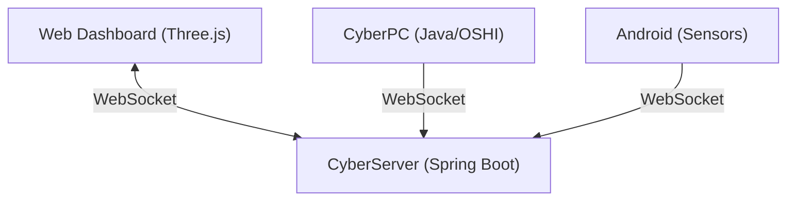

# CyberObserver (CyberMonitor)

> **Cyberpunk Style Cross-Device Real-time Monitoring System**

  

[🇨🇳 中文文档](README.md) | [🇺🇸 English](README_EN.md)

---

## 🌌 Vision

*"In the digital void, I see myself."*

**CyberObserver** represents the ultimate pursuit of **Digital Self-Awareness**. It is a holistic surveillance project born from a single developer's uncompromising desire for control and perfection. Using a minimalist Java technology stack, we bridge the gap between physical reality and digital representation.

The goal is to achieve **Omniscient Perception**:
- **Full-Spectrum Collection**: Aggregating battery status, active applications, background processes, and high-frequency sensor data from PCs and Mobile phones.
- **Inverse Kinematics (Human IK)**: Reconstructing the user's physical posture and environment through sensor fusion. If you sleep, the Cyber Avatar sleeps; if you work, it stands guard.
- **Reality Mirroring**: Visualizing device placement and multi-device synergy in a high-fidelity Web3D space.
- **God-Mode Control**: Authenticated remote execution to dominate your digital domain.

We refuse to compromise on features due to "personal limitations." Every line of code is a step towards the perfect convergence of Man and Machine.

---

## 📖 Introduction

**CyberObserver** is a "God View" monitoring system. It creates a digital twin of your working environment, rendering real-time telemetry into a Cyberpunk 3D interface.

## ✨ Features

### 1. The Brain (Server)
- **Tech**: Java (Spring Boot 3) + WebSocket + Three.js
- **Function**: Central data hub and 3D visualization.
- **Visuals**: Low-poly cyberpunk aesthetic, real-time device posture mirroring.

### 2. The Sentry (PC Agent)
- **Tech**: Java Native (OSHI + JNA)
- **Function**: Deep system monitoring.
    - CPU/Memory/Battery vitals.
    - Active Window detection.
    - Remote Control execution (Planned).

### 3. The Scout (Mobile Agent)
- **Tech**: Android Native (AccessibilityService)
- **Function**: Context awareness.
    - **Posture Inference**: Detects if you are walking, sleeping, or gaming based on sensors.
    - **App Usage**: Monitors current foreground application via AccessibilityService.

---

## 🛠️ Architecture



---

## 🚀 Quick Start

### Prerequisites
- JDK 17+
- Maven 3.6+
- Android Studio (For Mobile build)

### 2. Build project
```bash
# Root directory
mvn clean install
```

### 2. Start Server
```bash
cd server
mvn spring-boot:run
# Dashboard available at: http://localhost:8080
```

### 3. Start PC Agent
```bash
# Root directory
mvn exec:java -pl pc -Dexec.mainClass="com.cyber.pc.CyberPC"
```

### 4. Build Android App
- Open `mobile` folder in **Android Studio**.
- Build and install APK to your device.
- Grant **Accessibility Permissions** manually in System Settings.

---

## ⚠️ Disclaimer
This tool is intended for **personal use** on private devices only. The data collection (especially AccessibilityService) is highly invasive. Do not install on devices without explicit owner consent.

---

*Project by CyberObserver Team*
